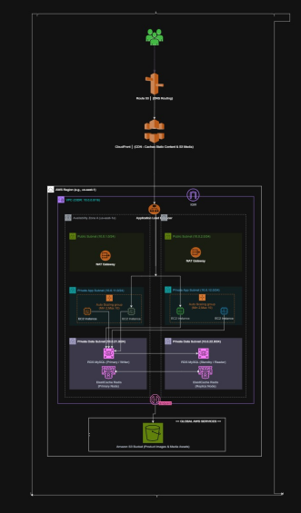

# 🏗️ Enterprise AWS Three-Tier Architecture — RetailEdge Inc.

An end-to-end AWS cloud migration project for **RetailEdge Inc.**, built using **Terraform Infrastructure as Code (IaC)**.

The architecture provides **high availability, scalability, security, and automated infrastructure deployment** across multiple Availability Zones.

---

## 🏠 Architecture

<p align="center">
  
</p>
The infrastructure is deployed across **two Availability Zones** using a custom VPC with:

* 🌐 Public Subnets
* ⚙️ Private Application Subnets
* 🗄️ Private Database Subnets

### AWS Services Used

* Amazon VPC
* EC2 & Auto Scaling
* Application Load Balancer
* Amazon RDS
* ElastiCache / Redis
* CloudFront
* Route 53
* S3
* DynamoDB

---

## 🖥️ Installation of Terraform

Make sure Terraform and AWS CLI are installed and configured before starting.

### Create S3 Backend

Create an S3 bucket to store the Terraform `.tfstate` file.

**Note:** Enable **Bucket Versioning** to protect the Terraform state from accidental deletion or modification.

### Create DynamoDB Table

Create a DynamoDB table for Terraform state locking.

Use:

```text
Partition Key: LockID
Type: String
```

---

## 🔑 Generate SSH Key Pair

Generate an SSH key pair for EC2 instances:

```bash
cd resources/compute-key/
ssh-keygen -t rsa -b 4096 -f client_key
```

---

## ⚙️ Configure Terraform Backend

Edit:

```text
environments/backend.tf
```

Add your backend configuration:

```hcl
terraform {
  backend "s3" {
    bucket         = "YOUR_BUCKET_NAME"
    key            = "backend/terraform.tfstate"
    region         = "us-east-1"
    dynamodb_table = "YOUR_DYNAMODB_TABLE"
  }
}
```

---

## 🔐 Configure Variables

Create:

```text
environments/terraform.tfvars
```

Example:

```hcl
region           = "us-east-1"
project_name     = "retailedge"

vpc_cidr         = "10.0.0.0/16"

pub_sub_1a_cidr  = "10.0.1.0/24"
pub_sub_2b_cidr  = "10.0.2.0/24"

pri_sub_3a_cidr  = "10.0.11.0/24"
pri_sub_4b_cidr  = "10.0.12.0/24"

pri_sub_5a_cidr  = "10.0.21.0/24"
pri_sub_6b_cidr  = "10.0.22.0/24"

db_username      = "admin"
db_password      = "YOUR_SECURE_PASSWORD"
```

> ⚠️ Do not upload real passwords or secrets to GitHub.

---

## 🚀 Deploy the Infrastructure

Move to the Terraform environment:

```bash
cd environments
```

Initialize Terraform:

```bash
terraform init
```

Validate the configuration:

```bash
terraform validate
```

Review the execution plan:

```bash
terraform plan
```

Finally, deploy the infrastructure:

```bash
terraform apply
```

Type:

```text
yes
```

to confirm the deployment.

---

## 📁 Project Structure

```text
CLOUD PROJECT/
├── architecture/
│   └── gg_260809_011558.jpg.jpeg
├── environments/
│   ├── main.tf
│   ├── providers.tf
│   ├── variables.tf
│   ├── outputs.tf
│   ├── backend.tf
│   └── terraform.tfvars
├── resources/
│   ├── VPC/
│   ├── security-groups/
│   ├── auto-scaling/
│   ├── load-balancer/
│   ├── database/
│   ├── cloudfront/
│   └── DNS/
├── .gitignore
└── README.md
```
## 🎥 Project Demo

[▶️ Watch the Project Demo](./architecture/Test.mp4)

---


## 👤 Author

**Hassan Sayed**

*Solutions Architect / Infrastructure Engineer*

**AWS • Terraform • Cloud • Networking • DevOps**
